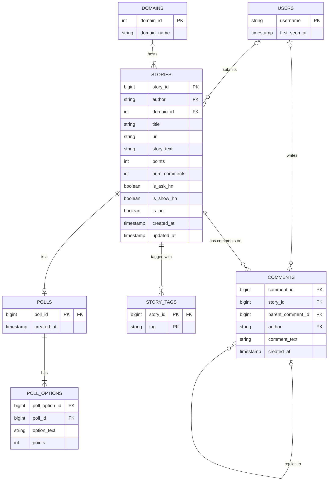

```mermaid
erDiagram
    USERS o|--o{ STORIES : submits
    USERS o|--o{ COMMENTS : writes
    DOMAINS o|--}| STORIES : hosts
    STORIES ||--o{ COMMENTS : "has comments on"
    STORIES ||--o{ STORY_TAGS : "tagged with"
    COMMENTS o|--o{ COMMENTS : "replies to"
    STORIES ||--o| POLLS : "is a"
    POLLS ||--}| POLL_OPTIONS : has

    USERS {
        string username PK
        timestamp first_seen_at
    }
    DOMAINS {
        int domain_id PK
        string domain_name
    }
    STORIES {
        bigint story_id PK
        string author FK
        int domain_id FK
        string title
        string url
        string story_text
        int points
        int num_comments
        boolean is_ask_hn
        boolean is_show_hn
        boolean is_poll
        timestamp created_at
        timestamp updated_at
    }
    STORY_TAGS {
        bigint story_id PK "FK"
        string tag PK
    }
    COMMENTS {
        bigint comment_id PK
        bigint story_id FK
        bigint parent_comment_id FK
        string author FK
        string comment_text
        timestamp created_at
    }
    POLLS {
        bigint poll_id PK "FK"
        timestamp created_at
    }
    POLL_OPTIONS {
        bigint poll_option_id PK
        bigint poll_id FK
        string option_text
        int points
    }
```
